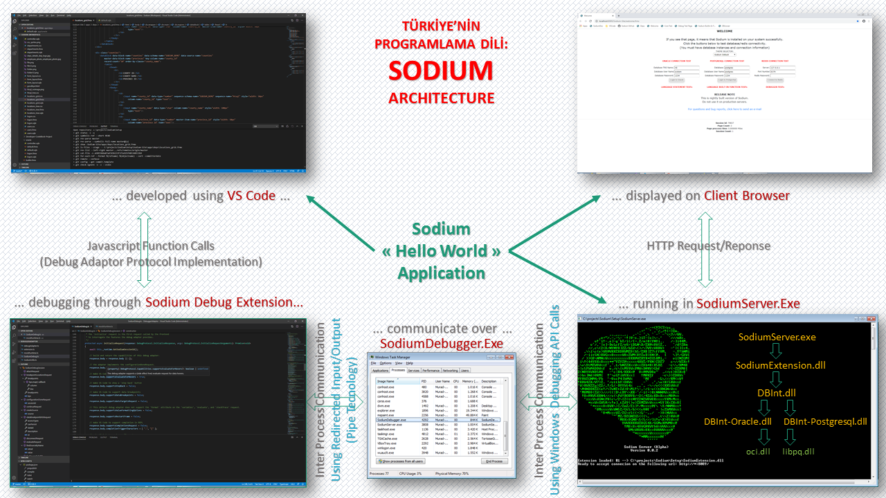

# Sodium Home Page

## What is Soduim?

Sodium is a new Domain-Specific Language \(DSL\) especially designed for creating/developing state of the art web based business applications. It has been under development at the moment but ready to be evaluated by developers.

Frontend developer, C developer, database developer etc. are needed. If you want be a contributer, please contact. \([About Me](about-me.md)\).

## What is the Motivation To Develop a New Software Language ?

* **Specially tailored for web based CRUD application development** Current software development languages \(php, asp, jsp, asp.net, etc\) and frameworks \(JSF, AngularJS, ExtJs\) are not solely designed for CRUD application. They are general-purpose development tools.  If you ;
  * need to develop just a web based CRUD application \(not device driver, game, etc, a dll or exe\),
  * have limited time for coding,
  * do not want to spend time to
    * learn frameworks/libraries/third party add-ons etc
    * learn some advanced topics like transaction management, dependency injection, persistence, object-relational mapping etc.
    * upgrade frameworks/libraries/third party add-ons etc
    * make configuration You should try Sodium.
* [Native SQL support](language-reference/native-sql-support.md) You can write SQL commands/scripts in code behind file as a first class native language commands. Unlike LINQ, you do not need to learn a special syntax for SQL commands. All syntax are accepted if it is a valid for database server. For more information [Native SQL support](language-reference/native-sql-support.md). Example: 

```text
void button_clicked() {
 
    /* Select statement */
    rsCounties = select county_name as label,
                        county_id as value
                 from
                        htsql.counties
                 order by
                        county_name;
    if (rsCounties) then
        message(rsCounties.label);
    end if;
 
    /* Insert statement */
    insert into hr.deps (DEP_ID, DEP_NAME) values (htsql_test.nextval, :depname);
 
    /* Update statement */
    update hr.deps
    set
        dep_name = 'HR'
    where
        dep_name like '%'|| :col || '%';
 
    /* Delete statement */
    delete
        hr.deps
    where
        dep_name = :dep_name;
 
    /*  Sub query */
    delete hr.emps
    where  dep_id in (select dep_id from deps where region_id like '%' || :param || '%');
 
    /* PL/SQL Anonymous block */
    begin
        for i in (select * from hr.emps e where e.retired = 'F') loop
            calculate_salary(i.emp_id);
        end loop;
    end;
}
```

* **Server and Client Side support**  Current web based languages/frameworks are designed to run either on server or client. Sodium is designed to run on both. All things are handled Sodium engine transparently.
* **No dependency**  All features written on this list are provided without third-party plug-ins, frameworks, code libraries, etc.
* **Easy to learn** **On server**: You do not need to learn some advanced topics/libraries such as Object Relational Mappings \(ORM\) tools, dependency injection, transaction management, user interface libraries, design patterns, etc. **On client:** No java script knowledge required, no CSS knowledge required, No library/framework required \(JQuery, AngularJS, ExtJs, bootstrap for mobile support\)
* **Native cached memory database support**
* **Easy to maintain** All requirements are handled in a standard way so developers easily find the code blocks to make corrections.
* **Quick and Easy Installation** No database repository needed No ODBC or OLE DB installation/configuration needed.
* **Basic HTML knowledge for visual design** No special IDE needed. Works with WYSWYG tools/applications.
* **Built-in AJAX support**
* **Built-in mobile support**
* **Fast** Sodium is especially designed for fast response time. Therefore,
  * it is developed using C language as a native Executable application.
  * Sodium does not use ODBC, OLE DB or other third party frameworks. It makes OCI calls for Oracle and libpq calls for Postgresql in order to fast access.
* **Web based**
* **Safe**
* **Absolutely free**
* **Support all major browsers**
* **No character encoding problem. Works well with database/client language/territory settings**

## How does Sodium works ?

### Components

* **SodiumServer.exe:** 

  Http Server

* **SodiumDebugger.exe:** 

  GNU Compliant Debugger \(GDB\)

* **DBInt.dll:** 

  Sodium-To-RDBMS interface

* **DBInt-Oracle.dll and DBInt-Postgresql.dll:** 

  RDBMS implementation files for different database vendors

* **SodiumExtension.dll:** 

  Sodium language Http Server plug-in

Whenever a \*.frmx file request \(with frmx extension\) has been made to the Generic Native Http Server \(SodiumServer.exe\), It delivers that request to the Sodium Server plug-in \(SodiumExtension.dll\). Sodium plug-in process the request and response accordingly.



| **Supported  Browsers** |  | Supported  Databases \(RDBMS\) |  | Supported  In-Memory Databases |  | Supported  Operation Systems |
| :---: | :--- | :---: | :--- | :---: | :--- | :---: |
|       |  |   |  |  |  |  |

