# Debugging

## Installation

Sodium comes with

* A native 64bit Windows Debugger application, **SodiumDebugger.exe \(SD\).**
* VS Code Debug Adaptor Protocol implementation, **Sodium-debug-0.37.0.vsix.**

 If you are a Sodium developer and want to debug your Sodium application, follow the steps below:

* Download and Install Visul Studio Code from [https://code.visualstudio.com/download](https://code.visualstudio.com/download)
* Run Visual Studio Code as administrator
* Find and click "Run \ Install Additional Debugger" menu item

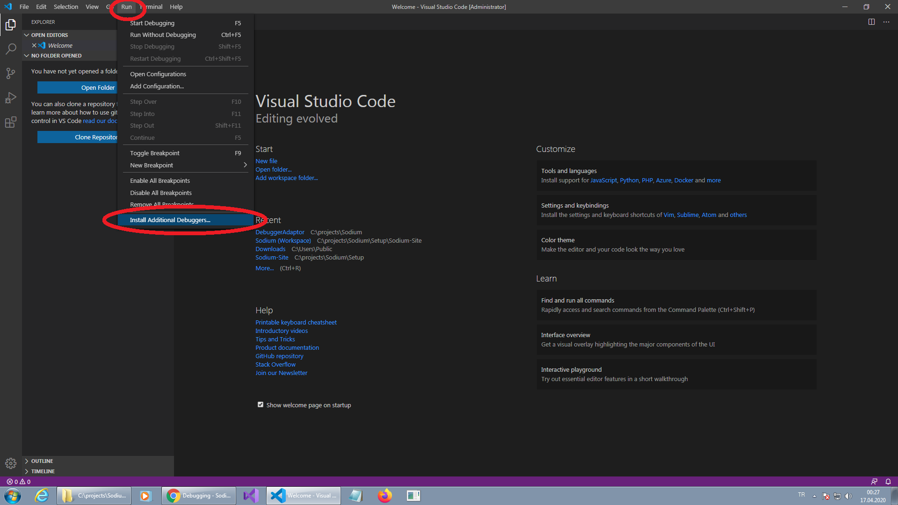

* Click "..." button to open pull-down menu and click "Install from VSIX..." menu item

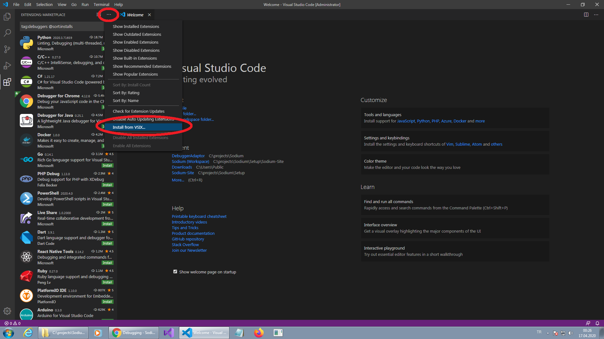

* Find and click "sodium-debug-x.x.x.vsix" file and click "Install" button

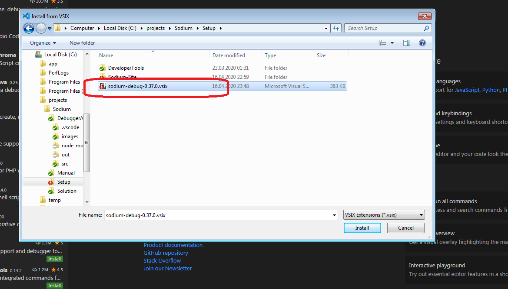

* After installation completes, you will see the screen below;

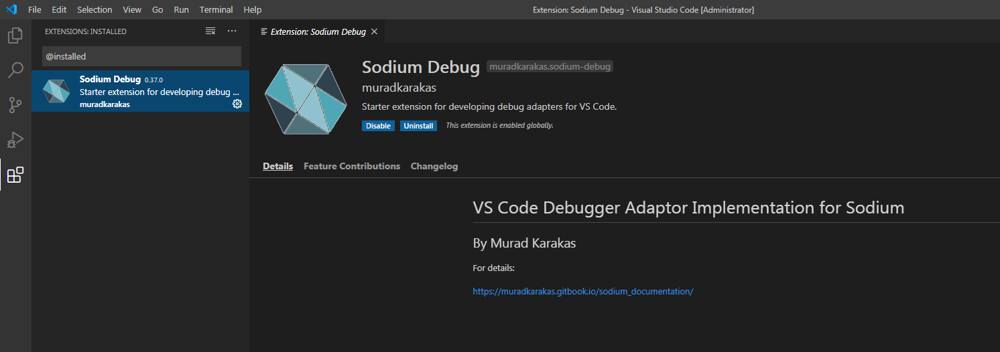

## How To Debug

Now, Sodium applications can be debugged using Visual Stuido Code editor. Follow the steps below;

* Run **StartSodiumServer.bat** file as administrator.
* Wait for internet browser to open and then find the "Session Id: XXXXX" section at the bottom of the page and copy the session id.

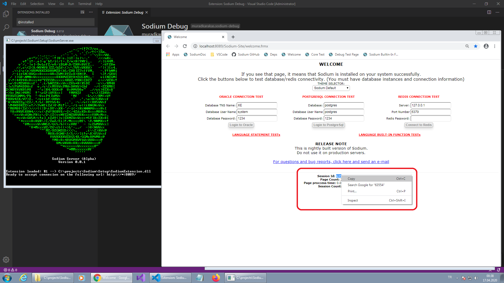

* Switch to Visual Stuido Code and then click "File \ Open Workspace" menu item
* Find "Sodium-Site" folder in Sodium installation folder and choose "Sodium.code-workspace" file and click "Open" button.

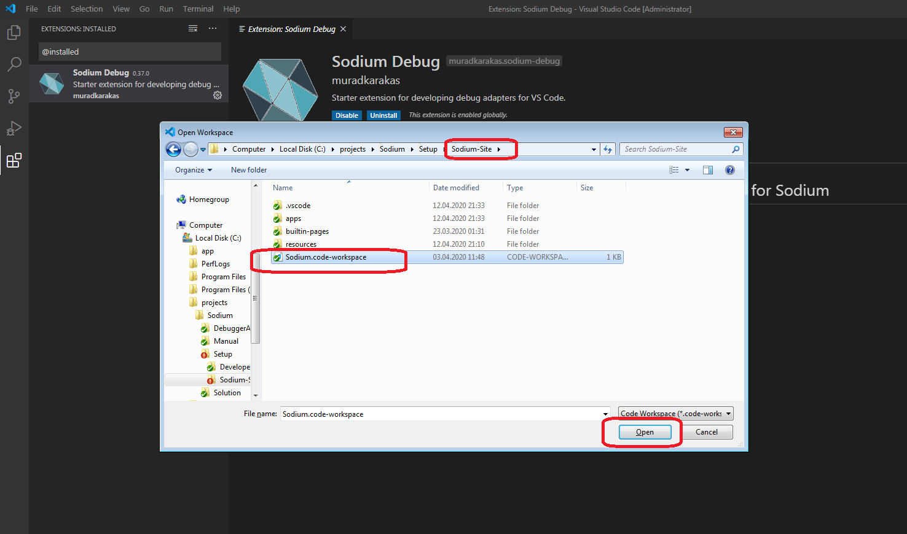

* Find and open "launch.json" file. Replace "Session Id" value with the correct value.
* "sdPath" must have the correct path for SodiumDebugger.exe. \(Put double \ character between folder names\)

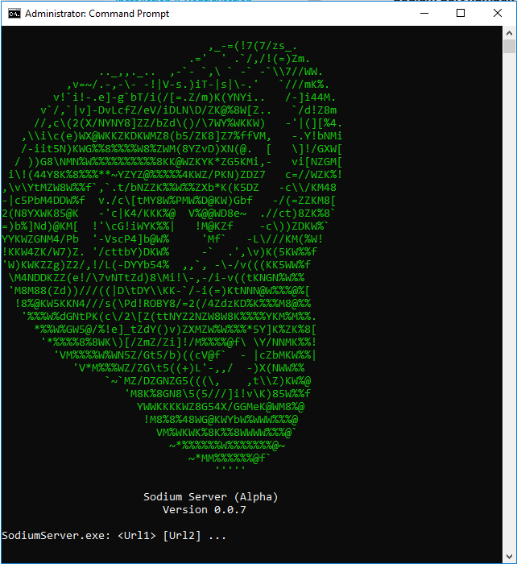

* Find and open the "welcome.sqlx" file in VS Code

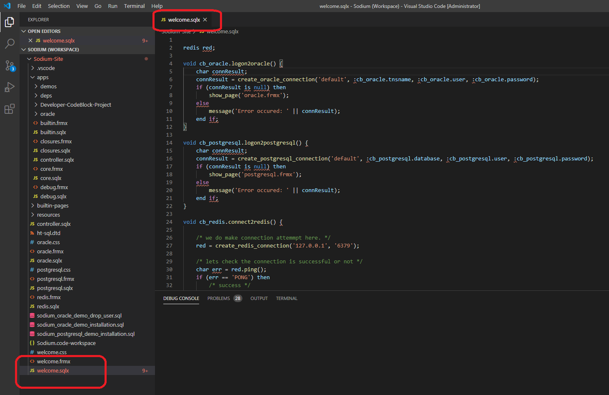

* Press F5 button. SodiumDebugger will be activated and VS Code will show debug view. 

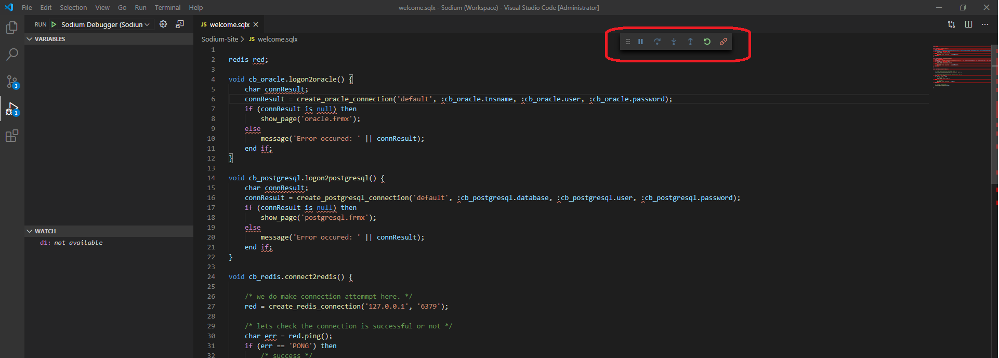

* Find `cb_oracle.logon2oracle()` function in the `welcome.sqlx` file and put a breakpoint on any line in that function.
* Reload web page. A new line will be appeared at the bottom of the page as shown below;

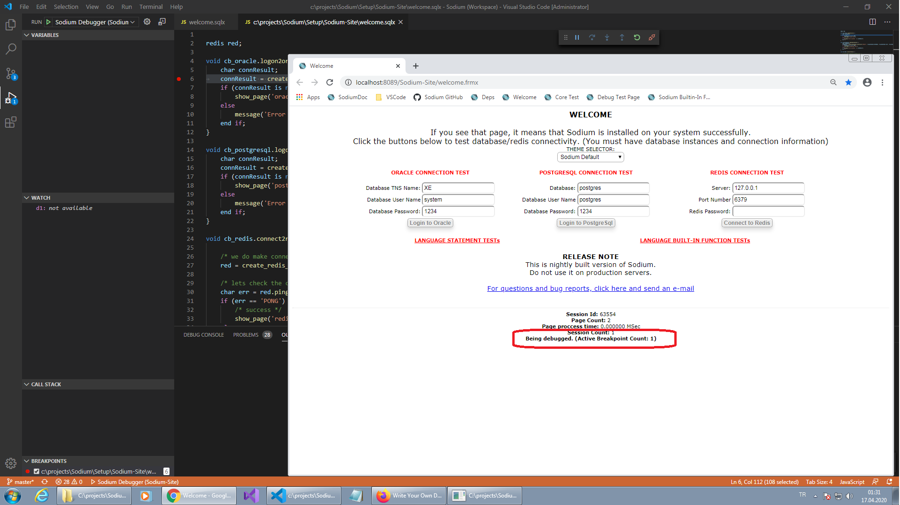

Click "Login to Oracle" button \(you do not need to have Oracle Database at this stage\). Execution of the "welcome.sqlx" file will be stopped and VS Code will point the line where the execution stopped. Also, VS Code will show "Watch", "Variables" and "Call Stacks" panels.

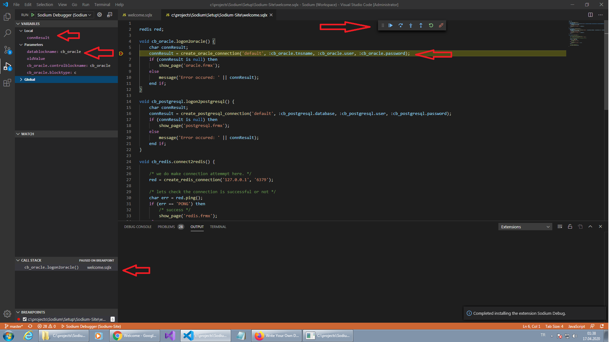

* Now, you can use following buttons to send debug commands to the debugger
  * F10 for Step-Over
  * F11 for Step-In
  * Shift-F11 for Step-Out
  * F5 for Continue

## Video Guide



