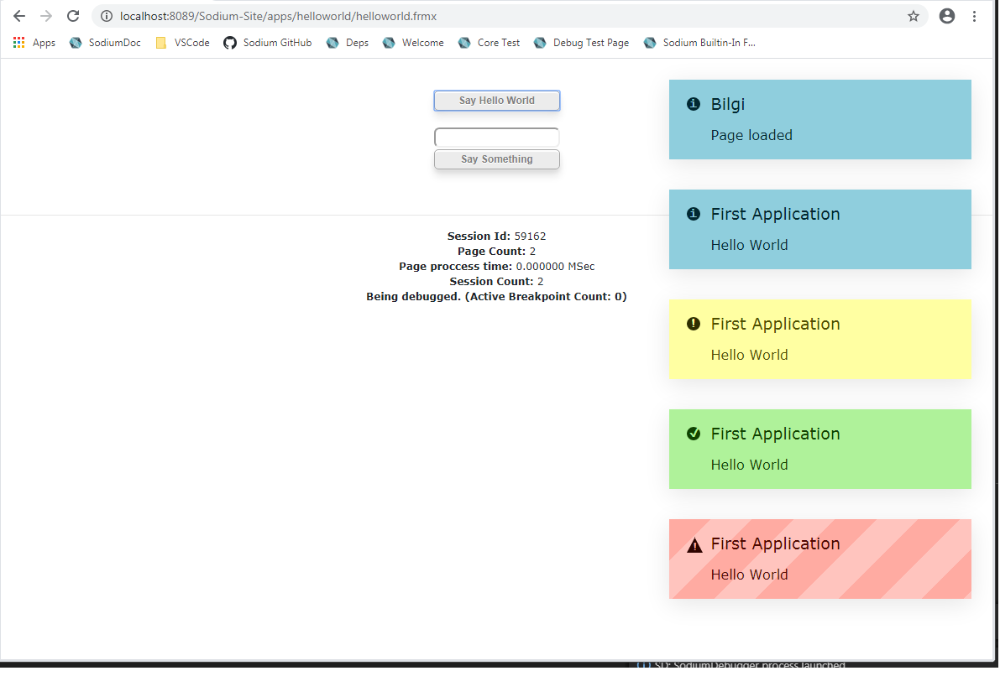

# Hello World Example

## Step 1: Folder Creation

Create a new sub folder named `helloworld` under the `Sodium-Site\apps` folder of the installation path.

## Step 2: Control File

**Controller File:** Create a file named `controller.sqlx`. It will be empty. For more information about [controller file](../../language-reference/program-structure/controller-file.md).

## Step 3: Form File

**Form File:** Create a file named `helloWorld.frmx` and copy/paste the code block showed below into the file.

```text
<!DOCTYPE html>
  
<html>
    <head>
        <title>Hello World</title>

    </head>
  
    <body>
        
        <br />
        <br />

        <controlblock control-block-name="cbDemo">
            <input name="say_hello_world" type="button" value="Say Hello World" style="display: block; margin-left: auto; margin-right: auto; width: 150px;"/>
            <br/>
            <input name="something" type="text" style="display: block; margin-left: auto; margin-right: auto; width: 150px;"/>
            <input name="say_something" type="button" value="Say Something" style="display: block; margin-left: auto; margin-right: auto; width: 150px;"/>
        </controlblock>
  
    </body>
</html>
```

**Form File Explanation:**

* It is a plain html file. The only difference is a `controlblock` tag on the lines between 14 and 19 with a name `control-block-name="cbDemo"`. For more information on control blocks, please follow the link [Control Block](https://sodium.gitbook.io/sodium/language-reference/html-tags/sodium-tags/control-block).
* There is nothing special about the input tag in the control block. For more information on buttons, please follow the link [Button Item](https://sodium.gitbook.io/sodium/language-reference/html-tags/html-tags/inputs/button-item).

## **Step 4: Code Behind File**

**Code behind File:** Create a file named `helloWorld.sqlx` and copy/paste the code block showed below into the file.

```text
void page.load() {
    message('Page loaded');
}

void cbDemo.say_hello_world() {
    message('First Application', 'Hello World', 'info');
    message('First Application', 'Hello World', 'notice');
    message('First Application', 'Hello World', 'success');
    message('First Application', 'Hello World', 'error');
}

void cbDemo.say_something() {
    message('Say', :cbDemo.something, 'error');
}
```

**Code behind Explanation:**

* Each form file must have a code behind file in the same directory. Code behind files has the same name but with `sqlx` extension. For more information on Code Behind files, please follow the link [Code Behind File](https://sodium.gitbook.io/sodium/language-reference/program-structure/code-behind-file).
* In the ["page\_load" trigger](https://sodium.gitbook.io/sodium/language-reference/built-in-triggers/page-level-triggers/page_load-trigger), [message](hello-world-example.md) function is used in order to show a message on the client browser.

## **Output**

**I**n order to open page, write the form file path into the address bar of the Internet browser. After each file request, "Page loaded" will be shown. After click on "Say Hello World" button, "Hello World" message will be shown on four times with different style.



